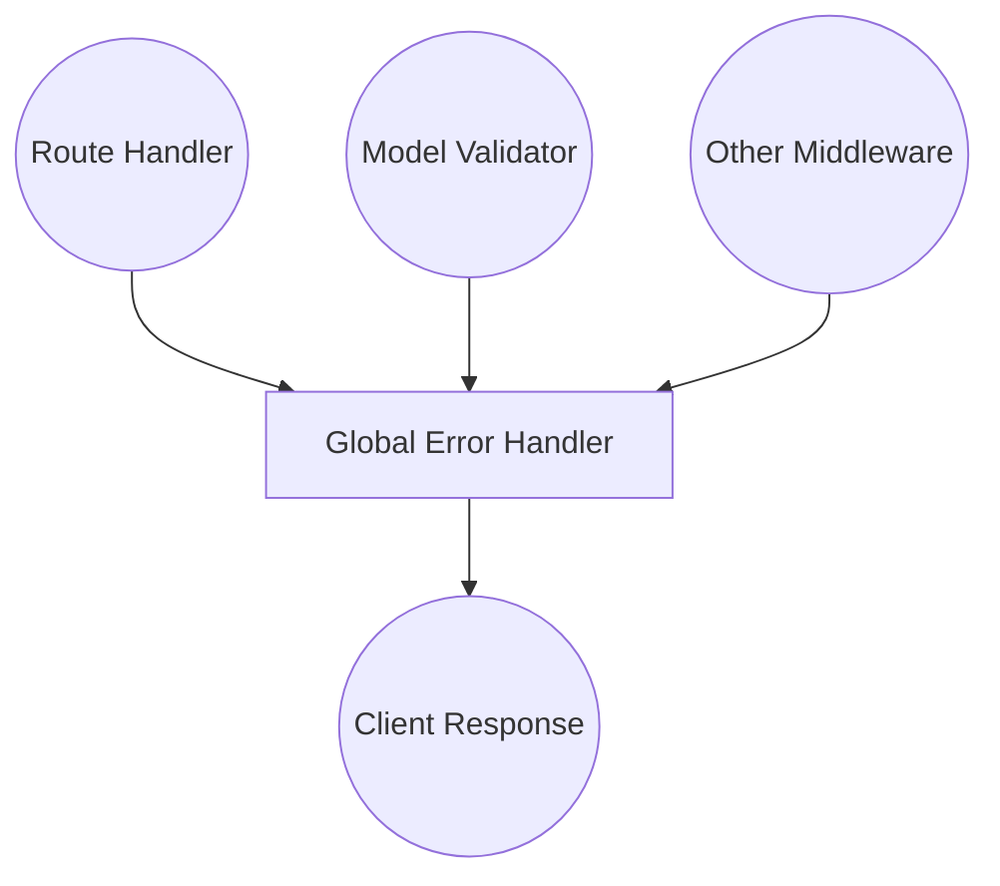

# 🛑 Error Handling in Node.js & Express

## Overview

Error handling is a crucial part of building robust Node.js and Express applications. Up to this point, you may have handled errors by simply sending back a JSON error message in each route handler. However, this approach is not scalable or maintainable for larger applications.

This documentation explains how to handle errors in a centralized and effective way, following best practices and the structure used in other parts of this course.

---

## Types of Errors in Express 🚦

There are two main types of errors you will encounter:

### 1. Operational Errors ⚙️

- Predictable problems that can happen during normal operation
- Not caused by bugs in your code
- Examples:
  - User accesses an invalid route
  - Invalid data input
  - Database connection failure

### 2. Programming Errors 🐞

- Bugs introduced by developers
- Harder to predict and handle
- Examples:
  - Reading properties from `undefined`
  - Using `await` without `async`
  - Typo in code (e.g., `request.query` instead of `request.body`)

> **Note:** The terms "error" and "exception" are often used interchangeably, but in this course, we refer to both as "errors" for simplicity.

---

## Error Handling Focus 🎯

When talking about error handling in Express, we mainly focus on **operational errors**. These are easier to catch and handle within your application.

---

## Centralized Error Handling Middleware 🧩

Express provides built-in error handling capabilities. The best practice is to use a **global error handling middleware** that catches errors from anywhere in your app—route handlers, model validators, or other middleware.

### How It Works



This central error handler allows you to:

- Send a clear response to the client
- Decide how to handle the error (respond, retry, crash, or ignore)
- Keep business logic and error handling separate

---

## Benefits of Centralized Error Handling 🌟

1. **Separation of Concerns**: Error handling is not mixed with business logic or controllers.
2. **Maintainability**: All errors are managed in one place.
3. **Consistency**: Clients receive consistent error responses.

---

## Example: Express Error Handling Middleware

```js
// ...existing code...
app.use((err, req, res, next) => {
  res.status(err.status || 500).json({
    status: 'error',
    message: err.message || 'Internal Server Error'
  });
});
// ...existing code...
```

---

## What Does "Handling" Mean? 🤔

Handling an error can mean:

- Sending a response to the client
- Retrying the operation
- Crashing the server (for critical errors)
- Ignoring the error (sometimes the best option)

---

## Summary

Centralized error handling in Express makes your application more robust, maintainable, and user-friendly. By distinguishing between operational and programming errors, and using a global error handler, you ensure that your app can gracefully handle unexpected situations.
